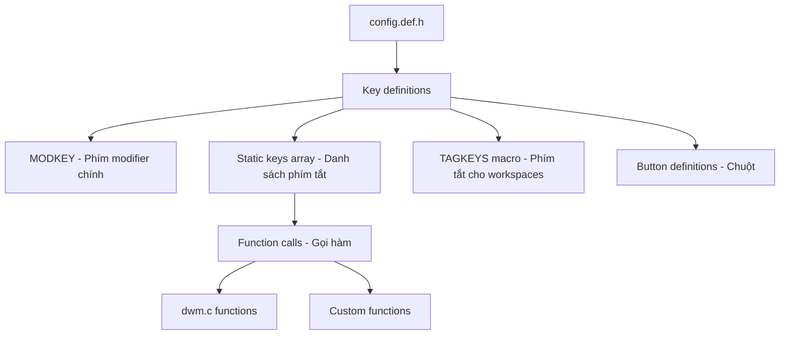

# Hướng Dẫn Chi Tiết: Tùy Chỉnh Keybindings và Shortcuts trong DWM

## Mục Lục

1. [Tổng Quan](#tổng-quan)
2. [Cấu Trúc Hệ Thống Phím Tắt](#cấu-trúc-hệ-thống-phím-tắt)
3. [Các Thành Phần Chính](#các-thành-phần-chính)
4. [Phân Tích Chi Tiết Các Nhóm Phím Tắt](#phân-tích-chi-tiết-các-nhóm-phím-tắt)
5. [Cách Tùy Chỉnh Keybindings](#cách-tùy-chỉnh-keybindings)
6. [Các Hàm Phổ Biến](#các-hàm-phổ-biến)
7. [Ví Dụ Thực Tế](#ví-dụ-thực-tế)
8. [TAGKEYS Macro System](#tagkeys-macro-system)
9. [Mouse Bindings](#mouse-bindings)
10. [Quy Trình Build và Test](#quy-trình-build-và-test)
11. [Tips và Best Practices](#tips-và-best-practices)

---

## Tổng Quan

DWM (Dynamic Window Manager) sử dụng một hệ thống keybinding được định nghĩa trong file `config.def.h`. Toàn bộ phím tắt được cấu hình thông qua các mảng static và macro, cho phép tùy chỉnh hoàn toàn theo nhu cầu người dùng.

## Cấu Trúc Hệ Thống Phím Tắt



## Các Thành Phần Chính

### 1. MODKEY - Phím Modifier Chính

**Vị trí**: Dòng 124 trong `config.def.h`

```c
#define MODKEY Mod4Mask
```

**Các tùy chọn:**

- `Mod4Mask`: Super/Windows key (mặc định)
- `Mod1Mask`: Alt key
- `ControlMask`: Ctrl key
- `ShiftMask`: Shift key

### 2. Cấu Trúc Key

```c
typedef struct {
    unsigned int mod;        // Phím modifier (MODKEY, ShiftMask, etc.)
    KeySym keysym;          // Phím chính (XK_a, XK_Return, etc.)
    void (*func)(const Arg *); // Hàm được gọi
    const Arg arg;          // Tham số truyền vào hàm
} Key;
```

### 3. Cấu Trúc Argument

```c
typedef union {
    int i;              // Integer values
    unsigned int ui;    // Unsigned integers (tags, etc.)
    float f;           // Float values (mfact, etc.)
    const void *v;     // Pointers (layouts, commands, etc.)
} Arg;
```

## Phân Tích Chi Tiết Các Nhóm Phím Tắt

### Nhóm 1: Media Controls (Âm thanh & Độ sáng)

```c
// Các phím media không cần MODKEY
{0, XF86XK_AudioLowerVolume,    spawn, {.v = downvol}},   // Giảm âm lượng
{0, XF86XK_AudioMute,           spawn, {.v = mutevol}},   // Tắt/bật âm thanh
{0, XF86XK_AudioRaiseVolume,    spawn, {.v = upvol}},     // Tăng âm lượng
{0, XF86XK_MonBrightnessUp,     spawn, {.v = light_up}},  // Tăng độ sáng
{0, XF86XK_MonBrightnessDown,   spawn, {.v = light_down}}, // Giảm độ sáng
```

### Nhóm 2: Screenshot và Utilities

```c
// Screenshot toàn màn hình
{MODKEY|ControlMask, XK_u, spawn,
    SHCMD("maim | xclip -selection clipboard -t image/png")},

// Screenshot vùng chọn
{MODKEY, XK_u, spawn,
    SHCMD("maim --select | xclip -selection clipboard -t image/png")},
```

### Nhóm 3: Application Launchers

```c
{MODKEY, XK_d,      spawn, SHCMD("rofi -show drun")}, // Launcher
{MODKEY, XK_Return, spawn, SHCMD("st")},              // Terminal
```

### Nhóm 4: Toggle Functions

```c
{MODKEY,                 XK_b,     togglebar,      {0}}, // Ẩn/hiện bar
{MODKEY|ControlMask,     XK_t,     togglegaps,     {0}}, // Bật/tắt gaps
{MODKEY|ShiftMask,       XK_space, togglefloating, {0}}, // Float/tile window
{MODKEY,                 XK_f,     togglefullscr,  {0}}, // Fullscreen
```

### Nhóm 5: Window Management

```c
{MODKEY, XK_j, focusstack,     {.i = +1}}, // Focus window tiếp theo
{MODKEY, XK_k, focusstack,     {.i = -1}}, // Focus window trước đó
{MODKEY|ShiftMask, XK_j, movestack, {.i = +1}}, // Di chuyển window xuống
{MODKEY|ShiftMask, XK_k, movestack, {.i = -1}}, // Di chuyển window lên
```

### Nhóm 6: Layout Controls

```c
{MODKEY, XK_h, setmfact, {.f = -0.05}}, // Giảm master area
{MODKEY, XK_l, setmfact, {.f = +0.05}}, // Tăng master area

{MODKEY, XK_t, setlayout, {.v = &layouts[0]}},  // Tile layout
{MODKEY|ShiftMask, XK_f, setlayout, {.v = &layouts[1]}}, // Monocle
{MODKEY, XK_m, setlayout, {.v = &layouts[2]}},  // Spiral
```

### Nhóm 7: Gap Controls (Chi tiết)

```c
// Tất cả gaps
{MODKEY|ControlMask, XK_i, incrgaps, {.i = +1}}, // Tăng tất cả gaps
{MODKEY|ControlMask, XK_d, incrgaps, {.i = -1}}, // Giảm tất cả gaps

// Inner gaps
{MODKEY|ShiftMask, XK_i, incrigaps, {.i = +1}}, // Tăng inner gaps
{MODKEY|ControlMask|ShiftMask, XK_i, incrigaps, {.i = -1}}, // Giảm inner gaps

// Outer gaps
{MODKEY|ControlMask, XK_o, incrogaps, {.i = +1}}, // Tăng outer gaps
{MODKEY|ControlMask|ShiftMask, XK_o, incrogaps, {.i = -1}}, // Giảm outer gaps

// Reset gaps
{MODKEY|ControlMask|ShiftMask, XK_d, defaultgaps, {0}}, // Reset về mặc định
```

### Nhóm 8: System Controls

```c
{MODKEY, XK_q, killclient, {0}},  // Đóng window hiện tại
{MODKEY|ShiftMask, XK_r, restart, {0}}, // Restart dwm
{MODKEY|ControlMask, XK_q, spawn, SHCMD("killall bar.sh chadwm")}, // Thoát dwm
```

## Cách Tùy Chỉnh Keybindings

### Modifier Combinations

```c
MODKEY                          // Super
MODKEY|ShiftMask               // Super + Shift
MODKEY|ControlMask             // Super + Ctrl
MODKEY|ControlMask|ShiftMask   // Super + Ctrl + Shift
```

### Key Symbols (Một số ví dụ)

```c
XK_Return    // Enter
XK_space     // Spacebar
XK_Tab       // Tab
XK_Escape    // Escape
XK_BackSpace // Backspace
XK_a         // Chữ a
XK_1         // Số 1
XK_F1        // F1
XK_Left      // Mũi tên trái
```

## Các Hàm Phổ Biến

### Window Focus & Movement

```c
focusstack({.i = +1})    // Focus window tiếp theo
focusstack({.i = -1})    // Focus window trước đó
movestack({.i = +1})     // Di chuyển window xuống
movestack({.i = -1})     // Di chuyển window lên
zoom({0})                // Swap với master window
```

### Layout Management

```c
setlayout({.v = &layouts[0]})  // Chuyển sang layout đầu tiên
setmfact({.f = +0.05})         // Tăng master area 5%
setmfact({.f = -0.05})         // Giảm master area 5%
incnmaster({.i = +1})          // Tăng số master windows
incnmaster({.i = -1})          // Giảm số master windows
```

### Gap Controls

```c
incrgaps({.i = +1})      // Tăng tất cả gaps
incrgaps({.i = -1})      // Giảm tất cả gaps
incrigaps({.i = +5})     // Tăng inner gaps 5px
incrogaps({.i = -5})     // Giảm outer gaps 5px
defaultgaps({0})         // Reset về gaps mặc định
togglegaps({0})          // Bật/tắt gaps
```

### Spawn Commands

```c
spawn({.v = termcmd})              // Chạy terminal
spawn(SHCMD("firefox"))            // Chạy firefox
spawn(SHCMD("dmenu_run"))          // Chạy dmenu
spawn(SHCMD("flameshot gui"))      // Chạy screenshot tool
```

## Ví Dụ Thực Tế

### Thêm Application Shortcuts

```c
// Thêm vào mảng keys[]
{MODKEY,             XK_w, spawn, SHCMD("firefox")},           // Firefox
{MODKEY,             XK_e, spawn, SHCMD("thunar")},            // File manager
{MODKEY,             XK_c, spawn, SHCMD("code")},              // VS Code
{MODKEY|ShiftMask,   XK_w, spawn, SHCMD("firefox --private-window")}, // Private browsing
```

### Screenshot Shortcuts

```c
{MODKEY,             XK_Print, spawn, SHCMD("flameshot full")},     // Full screenshot
{MODKEY|ShiftMask,   XK_Print, spawn, SHCMD("flameshot gui")},      // Area screenshot
{MODKEY|ControlMask, XK_Print, spawn, SHCMD("flameshot screen")},   // Current screen
```

### Custom Gap Controls

```c
{MODKEY|ControlMask, XK_equal, incrgaps, {.i = +5}},  // Tăng gaps 5px
{MODKEY|ControlMask, XK_minus, incrgaps, {.i = -5}},  // Giảm gaps 5px
{MODKEY|ControlMask, XK_0,     defaultgaps, {0}},     // Reset gaps
{MODKEY|ControlMask, XK_g,     togglegaps, {0}},      // Toggle gaps
```

### System Control

```c
{MODKEY|ShiftMask, XK_l, spawn, SHCMD("slock")},                    // Lock screen
{MODKEY|ShiftMask, XK_q, spawn, SHCMD("systemctl poweroff")},       // Shutdown
{MODKEY|ShiftMask, XK_r, spawn, SHCMD("systemctl reboot")},         // Reboot
{MODKEY|ShiftMask, XK_s, spawn, SHCMD("systemctl suspend")},        // Suspend
```

### Media Controls Mở Rộng

```c
{MODKEY, XK_F1,  spawn, SHCMD("playerctl previous")},  // Previous track
{MODKEY, XK_F2,  spawn, SHCMD("playerctl play-pause")}, // Play/pause
{MODKEY, XK_F3,  spawn, SHCMD("playerctl next")},      // Next track
{MODKEY, XK_F4,  spawn, SHCMD("playerctl stop")},      // Stop
```

## TAGKEYS Macro System

### Định Nghĩa Macro

```c
#define TAGKEYS(KEY,TAG) \
    { MODKEY,                       KEY,      view,           {.ui = 1 << TAG} }, \
    { MODKEY|ControlMask,           KEY,      toggleview,     {.ui = 1 << TAG} }, \
    { MODKEY|ShiftMask,             KEY,      tag,            {.ui = 1 << TAG} }, \
    { MODKEY|ControlMask|ShiftMask, KEY,      toggletag,      {.ui = 1 << TAG} },
```

### Chức Năng Của Từng Combination

- `MODKEY + [1-9]`: Chuyển sang workspace
- `MODKEY + Ctrl + [1-9]`: Hiển thị thêm workspace (multiple view)
- `MODKEY + Shift + [1-9]`: Di chuyển window sang workspace
- `MODKEY + Ctrl + Shift + [1-9]`: Tag window cho multiple workspaces

### Áp Dụng

```c
TAGKEYS(XK_1, 0)  // Workspace 1
TAGKEYS(XK_2, 1)  // Workspace 2
TAGKEYS(XK_3, 2)  // Workspace 3
// ... tiếp tục đến XK_9
```

## Mouse Bindings

### Cấu Trúc Button

```c
typedef struct {
    unsigned int click;      // Loại click (ClkTagBar, ClkClientWin, etc.)
    unsigned int mask;       // Modifier mask
    unsigned int button;     // Mouse button (Button1, Button2, Button3)
    void (*func)(const Arg *); // Function to call
    const Arg arg;          // Arguments
} Button;
```

### Ví Dụ Mouse Bindings

```c
static const Button buttons[] = {
    /* click                event mask      button          function        argument */
    { ClkLtSymbol,          0,              Button1,        setlayout,      {0} },
    { ClkWinTitle,          0,              Button2,        zoom,           {0} },
    { ClkStatusText,        0,              Button2,        spawn,          SHCMD("st") },

    { ClkClientWin,         MODKEY,         Button1,        moveorplace,    {.i = 0} },
    { ClkClientWin,         MODKEY,         Button2,        togglefloating, {0} },
    { ClkClientWin,         MODKEY,         Button3,        resizemouse,    {0} },

    { ClkTagBar,            0,              Button1,        view,           {0} },
    { ClkTagBar,            0,              Button3,        toggleview,     {0} },
    { ClkTagBar,            MODKEY,         Button1,        tag,            {0} },
    { ClkTagBar,            MODKEY,         Button3,        toggletag,      {0} },
};
```

### Các Loại Click Areas

- `ClkTagBar`: Click vào tag area
- `ClkLtSymbol`: Click vào layout symbol
- `ClkStatusText`: Click vào status text
- `ClkWinTitle`: Click vào window title
- `ClkClientWin`: Click vào window content
- `ClkRootWin`: Click vào desktop

## Quy Trình Build và Test

### Bước 1: Backup Config

```bash
cp config.def.h config.def.h.backup
```

### Bước 2: Chỉnh Sửa

```bash
vim config.def.h  # hoặc editor khác
```

### Bước 3: Build

```bash
make clean
make
```

### Bước 4: Test (Optional)

```bash
# Test trong Xephyr (nested X session)
Xephyr -screen 1024x768 :1 &
DISPLAY=:1 ./dwm
```

### Bước 5: Install

```bash
sudo make install
```

### Bước 6: Restart DWM

```
Super + Shift + R  # hoặc logout/login
```

## Tips và Best Practices

### 1. Tổ Chức Phím Tắt Logic

```c
// Nhóm theo chức năng
// Applications: MODKEY + letter
{MODKEY, XK_w, spawn, SHCMD("firefox")},      // Web browser
{MODKEY, XK_e, spawn, SHCMD("thunar")},       // Explorer
{MODKEY, XK_c, spawn, SHCMD("code")},         // Code editor

// System: MODKEY + Shift + letter
{MODKEY|ShiftMask, XK_l, spawn, SHCMD("slock")},     // Lock
{MODKEY|ShiftMask, XK_q, spawn, SHCMD("poweroff")},  // Quit/shutdown

// Fine control: MODKEY + Ctrl + key
{MODKEY|ControlMask, XK_h, setmfact, {.f = -0.01}}, // Fine adjust left
{MODKEY|ControlMask, XK_l, setmfact, {.f = +0.01}}, // Fine adjust right
```

### 2. Tránh Conflicts

```c
// Kiểm tra xem phím tắt có bị trùng không
// Sử dụng tools như:
// xev - để kiểm tra key codes
// showkey - để xem key events
```

### 3. Documentation

```c
// Comment rõ ràng cho từng binding
{MODKEY, XK_d, spawn, SHCMD("rofi -show drun")}, // Application launcher
{MODKEY, XK_Return, spawn, SHCMD("st")},          // Terminal emulator
```

### 4. Testing Strategy

1. **Incremental testing**: Test từng nhóm phím tắt
2. **Use nested session**: Test trong Xephyr trước khi apply
3. **Keep backup**: Luôn backup config working
4. **Document changes**: Ghi chú những gì đã thay đổi

### 5. Common Patterns

```c
// Pattern 1: Application launchers
{MODKEY, XK_[letter], spawn, SHCMD("[app-name]")},

// Pattern 2: Window management
{MODKEY|ShiftMask, XK_[key], [move-function], {.i = [direction]}},

// Pattern 3: Layout controls
{MODKEY|ControlMask, XK_[key], [layout-function], {.f = [amount]}},

// Pattern 4: System controls
{MODKEY|ShiftMask, XK_[key], spawn, SHCMD("[system-command]")},
```

### 6. Command Definitions

```c
// Định nghĩa commands ở đầu file để dễ quản lý
static const char *termcmd[]  = { "st", NULL };
static const char *roficmd[]  = { "rofi", "-show", "drun", NULL };
static const char *firefoxcmd[] = { "firefox", NULL };

// Sử dụng trong keys array
{MODKEY, XK_Return, spawn, {.v = termcmd}},
{MODKEY, XK_d,      spawn, {.v = roficmd}},
{MODKEY, XK_w,      spawn, {.v = firefoxcmd}},
```

---

## Kết Luận

Hệ thống keybinding của DWM rất linh hoạt và mạnh mẽ. Với việc hiểu rõ cấu trúc và các pattern phổ biến, bạn có thể tùy chỉnh hoàn toàn theo workflow của mình. Hãy nhớ luôn test kỹ trước khi apply changes và backup config trước khi thay đổi lớn.

**Lưu ý**: File này dựa trên phiên bản chadwm được tùy chỉnh. Một số features có thể khác so với vanilla dwm.
