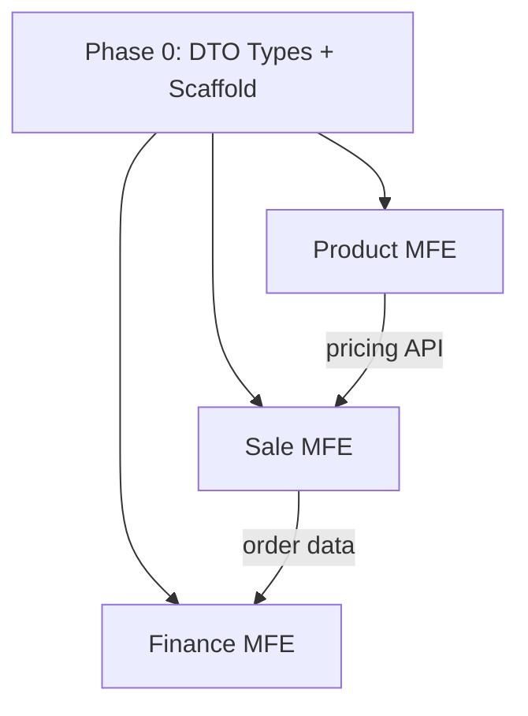

# Module Decomposition & Task Breakdown

Use this skill when the user has a monolithic application (single-page app, legacy codebase) and wants to break it into modules/MFEs with a concrete task plan for a team.

## When to use

- User wants to "split this into modules for N developers"
- User asks for "task list for the team"
- User provides a single-file app (e.g., CRM.html) and wants MFE decomposition
- User needs "task definitions" to import into GitLab/Jira

## Process

### Step 1: Understand the codebase

Read and analyze:

```python
# Find the main app file
read_file("path/to/main.html")
# Count lines
search_files("*.html|*.js|*.tsx", target="files", path="src/")
# Understand data structures (mock data, DTOs)
search_files("const.*\\[\\]", path="src/", file_glob="*.{html,js,ts}")
```

Key things to extract:
- **Business domains** (Sales, Finance, Products, HR...)
- **Data structures** and DTOs (arrays, interfaces)
- **Route structure** (tabs, navigation)
- **Role/permission model**
- **Cross-cutting concerns** (auth, navigation shell, shared state)
- **Function inventory** — extract all top-level function names with `grep -oP '^function \K\w+' source.html` to identify every screen, modal, and utility. This prevents blind spots.

### Step 2: Define module boundaries

Group screens/routes into modules by business domain:

| Signal | Suggests separate module |
|--------|-------------------------|
| Own data lifecycle | Yes |
| Different user roles access it | Maybe |
| Shared with other domains only via API | Yes |
| Small, < 3 screens | Could merge |

**Rules:**
- Each MFE = 1 domain with limited interdependency
- Cross-cutting (auth, shell, shared UI libs) = separate shared packages, not an MFE
- Shared DTO types = `packages/shared/src/types/` — define first as API contract
- If a domain appears in 2+ modules → decide who owns it (e.g., CKS pricing owned by Product, CKS workflow owned by Sale)

### Step 2.5: Gap analysis against reference UI (quality gate)

**Critical validation step before finalizing tasks.** After designing module boundaries and task list, cross-reference against ALL existing UI/UX artifacts:

1. Load the main monolithic app file (e.g., CRM.html) and any mindmap / flow diagram files
2. Scan for every screen, tab, button, table, and modal in the source
3. For each, check: "Is there a task in my plan that covers this?"
4. Common things missed:
   - Tax rate CRUD (hidden in a sub-tab)
   - Commission reconciliation (often in Finance, not Sale)
   - Bank transaction reconciliation
   - Customer agent transfer
   - Payment receipt with proof upload (file attachment on payment collection)
   - Price history tracking
   - **Contract generation** (genContract) — legal document generation with proper Vietnamese formatting, tax breakdown, signature blocks
   - **Phiếu đăng ký / application form generation** (genPhieu) — e.g., DK01.1.CKS for certificate registration
   - **eKYC sync dashboard** — the full page listing synced orders from external app, not just the sync bridge widget
   - **Debt reconciliation** as separate workflow from debt tracking — statements, send-to-customer, confirm/dispute cycle
5. **Expected hit rate**: initial pass will miss 3-6 items per 15-20 tasks

**Output**: gap table like:

| # | Gap | Task affected | Fix |
|---|-----|---------------|-----|
| 1 | Commission reconciliation missing | Add TASK-2.5 (new) | ~5 SP |
| 2 | Tax rate CRUD missing from TASK-3.1 | Expand TASK-3.1 | +2 SP |

Then update the task file and sync changes to GitLab.

### Step 3: Ask 7 architectural questions before finalizing

Before writing task lists, clear these with the user (or the coding agent's plan):

1. **Shell ownership** — who builds the app shell (nav, auth, route registry)?
2. **Orphan modules** — "Cá nhân" / profile / settings that don't fit any module
3. **Cross-cutting domains** — e.g., CKS appears in Sale, Product (pricing), Finance (fees)
4. **Backend ownership** — FE-only vs full-stack vs separate BE team
5. **Shared libraries** — types, utils, UI kit
6. **Reports ownership** — cross-module queries belong to one module (usually Finance)
7. **External integrations** — eKYC, third-party apps

### Step 4: Design task definition format

Each task must have:

| Field | Purpose |
|-------|---------|
| **Title** | Human-readable, prefixed `[TASK-X.Y]` |
| **Assignee** | Who |
| **Priority** | Critical / High / Medium / Low |
| **Story Points** | 1 SP ≈ 1 dev-day |
| **Labels** | `crm-decomposition`, `fe-only`, `phase-N` |
| **Depends on** | Blocking task IDs |
| **Blocks** | What it blocks |
| **Description** | Goal + approach |
| **Files to create** | Exact paths, every file |
| **Acceptance Criteria** | Bullet list of pass/fail checks |
| **Technical Notes** | Conventions, edge cases, references |

**Acceptance criteria checklist (from this project's AGENTS.md):**
- [ ] All 4 UI states: Empty, Loading (Skeleton), Success, Error (retry button)
- [ ] React Query hooks with mock data returning `{ data, success, code }`
- [ ] DTO-first display: no adapter/mapper layer
- [ ] i18n flatten: `t('entity.fieldName')`
- [ ] Mutation + Toast: success/error toasts on every user action
- [ ] Narrow DTOs per use case
- [ ] `pnpm --filter <app> typecheck` passes

### Step 5: Map file count

Estimate per module:

| Module size | Components | Pages | Hooks | APIs | Total |
|-------------|-----------|-------|-------|------|-------|
| Small (1-2 screens) | 4-5 | 1-2 | 2-3 | 1 | 8-12 |
| Medium (3-5 screens) | 8-12 | 3-4 | 4-6 | 1 | 16-23 |
| Large (5-8 screens) | 12-18 | 5-6 | 6-8 | 1 | 24-33 |

### Step 6: Create dependency map



Document cross-team API dependencies in a table:

| API | From | To | When no BE |
|-----|------|----|-----------|
| `GET /api/x` | Team A | Team B | A mocks response |

### Step 7: Sync to GitLab (update existing + create new issues)

After gap analysis and task file updates, sync changes to GitLab:

**Update existing issues** (when a task's scope changed):
```bash
curl -s -X PUT --header "PRIVATE-TOKEN: $GITLAB_TOKEN" \
  "$GITLAB_URL/projects/9/issues/<IID>" \
  -d '{"title":"[TASK-1.2] Updated title","description":"**GAP fix: added Agent Transfer**\n\nNew components added..."}'
```

**Create new issues** (when gaps found):
```bash
curl -s -X POST --header "PRIVATE-TOKEN: $GITLAB_TOKEN" \
  "$GITLAB_URL/projects/9/issues" \
  -d '{
    "title": "[TASK-2.5] Commission reconciliation",
    "description": "...",
    "labels": "crm-decomposition,fe-only,phase-2,finance",
    "assignee_ids": [10]
  }'
```

**Batch assign** after creation:
```bash
curl -s -X PUT --header "PRIVATE-TOKEN: $GITLAB_TOKEN" \
  "$GITLAB_URL/projects/9/issues/<IID>" \
  -d '{"assignee_ids":[10]}'
```

Copy project ID and user IDs from the GitLab reference file.

### Step 8: Task lifecycle updates (reassign, relabel, module moves, date changes)

After initial creation, tasks need lifecycle updates: module moves, assignee changes, date adjustments, label changes. Each update must hit **both** the GitLab issue AND the tracking CSV (if one exists).

**Pattern: read → modify → PUT** (GitLab description is NOT automatically updated by title/label changes — you must read + write separately):

```python
def update_gitlab_issue(project_id, iid, token, base_url,
                         new_title=None, new_desc=None,
                         new_labels=None, new_assignee_id=None):
    import urllib.request, urllib.parse, json
    fields = {}
    if new_title: fields["title"] = new_title
    if new_labels: fields["labels"] = ",".join(new_labels)
    if new_assignee_id: fields["assignee_id"] = str(new_assignee_id)
    # Description must be included in same PUT if changing it
    if new_desc: fields["description"] = new_desc
    data = urllib.parse.urlencode(fields).encode()
    headers = {"PRIVATE-TOKEN": token, "Content-Type": "application/x-www-form-urlencoded"}
    req = urllib.request.Request(f"{base_url}/projects/{project_id}/issues/{iid}",
                                  data=data, headers=headers, method="PUT")
    with urllib.request.urlopen(req) as r:
        return json.loads(r.read())
```

**Key API facts (not obvious):**
- `start_date` is **NOT** writable via `PUT /projects/:id/issues/:iid` (GitLab returns 400). Only `due_date` is settable on issues.
- Labels via form-encoded PUT: comma-separated string (`"labels": "sales,fe-only,phase-2"`)
- Vietnamese / Unicode characters work fine with `urllib.parse.urlencode`
- Description field is NOT modified when you update title/labels — you MUST include it in the same PUT

**CSV ↔ GitLab dual sync rule:**
When the project uses both a tracking CSV (for import into a task management tool) AND GitLab issues, every update must be made in BOTH places:

| Change | GitLab | CSV |
|--------|--------|-----|
| Module move | Title + labels + description | `Tính năng` column |
| Assignee change | `assignee_id` + description `Người nhận` | `Người thực hiện` column |
| Date change | `due_date` only (not `start_date`) | `Ngày bắt đầu` + `Deadline (PM)` + `Tuần - Tháng/Năm` columns |
| Label change | `labels` field | `Tính năng` + `Phase` columns |

**Example: move 3 tasks from Finance to Sales module:**
```python
import urllib.request, urllib.parse, json

TOKEN="glpat-..."
BASE="https://gitlab.vppos.vn/api/v4"
HEADERS={"PRIVATE-TOKEN":TOKEN,"Content-Type":"application/x-www-form-urlencoded"}

for iid in [18, 25, 26]:
    # 1. Read current issue
    req = urllib.request.Request(f"{BASE}/projects/9/issues/{iid}", headers=HEADERS)
    res = json.loads(urllib.request.urlopen(req).read())

    # 2. Modify
    new_title = res["title"].replace("[Tài chính]", "[Bán hàng & CRM]")
    new_desc = res["description"].replace("Người nhận: Cường", "Người nhận: Lưu Khoa Học")
    new_labels = "sales,fe-only,phase-2,reports"  # replaced "finance" with "sales"

    # 3. Write back
    data = urllib.parse.urlencode({
        "title": new_title,
        "description": new_desc,
        "labels": new_labels,
        "assignee_id": "8"
    }).encode()
    req2 = urllib.request.Request(f"{BASE}/projects/9/issues/{iid}",
                                   data=data, headers=HEADERS, method="PUT")
    json.loads(urllib.request.urlopen(req2).read())
```

Then update the CSV rows in parallel.

### Step 8.5: Verify task definitions ↔ GitLab issues sync

After any round of updates, run a full cross-check to catch drift between the tracking file and GitLab. This catches: wrong assignees, wrong labels, outdated descriptions, missing SP, module moves that weren't fully synced.

**Quick verification command:**
```bash
curl -s --header "PRIVATE-TOKEN: $TOKEN" \
  "$BASE/projects/$PID/issues?per_page=100&order_by=iid&sort=asc" | \
  python3 -c "
import json,sys
for i in json.load(sys.stdin):
    print(f'#{i[\"iid\"]:2d} | {i[\"title\"][:60]:60s} | {i.get(\"assignee\",{}).get(\"name\",\"N/A\") if i.get(\"assignee\") else \"N/A\":20s} | {i.get(\"labels\",[])}')
"
```

Then compare each row against the MD file. Check for:
- **Assignee mismatch** — most common after module moves
- **Labels mismatch** — module labels (sale/finance/product) wrong after reassignment
- **Description outdated** — tabs, components, file paths, AC don't match current design
- **SP mismatch** — description says one number, MD says another

**Source of truth rule:** When user says "issue X is correct, update MD" — GitLab wins. When user says "update the issue" — MD wins. Always confirm with user which is authoritative before bulk-syncing.

**Module move checklist** — when a task moves from Module A to Module B, update ALL of:
1. Assignee (who owns the new module)
2. Labels (module label: `sale`/`finance`/`product`)
3. File paths (`apps/old-module/` → `apps/new-module/`)
4. Description (module context, cross-references)
5. MD summary table

### Step 9: Final verification pass (function-level scan)

After all task updates and GitLab sync, do one more automated scan of the monolithic source file to catch any missed features:

```bash
# Extract all function names from the source
grep -oP '^function \K\w+' path/to/monolith.html | sort > /tmp/all_funcs.txt

# List what's covered by your tasks (populate manually or from task descriptions)
cat > /tmp/covered_funcs.txt << 'EOF'
customersList
ordersList
...
EOF

# Find uncovered
comm -23 /tmp/all_funcs.txt /tmp/covered_funcs.txt
```

Filter the output: helper functions (validEmail, date formatting, etc.) are OK. Standalone page-level functions (genContract, genPhieu, ekycAppView) are gaps to add.

### Step 10: Multi-agent handoff

This skill is designed for a **BA/planning agent producing output for a coding agent**. Typical flow:

1. Planning agent analyzes codebase, designs modules, writes task definitions → saves to `plans/crm_task_definitions.md`
2. Coding agent (e.g., Antigravity, Claude Code) reviews the plan, traces codebase, updates the plan with corrections, and assigns real people
3. Planning agent syncs final definitions to GitLab issues

The two agents never need to share context — the markdown file in the project is the handoff artifact.

## Pitfalls

- **Unclear BE ownership** = blockers. Decide FE-only or fullstack first.
- **Wrong scaffold command** = wasted time. Check project's own scripts (`scripts/create-mfe.sh`, etc.) before using generic npx.
- **DTO types done last** = everyone blocked. Must be Phase 0, Task 0.1.
- **Cross-cutting domain (CKS) not assigned** = each module assumes the other handles it. Explicitly assign every domain.
- **Skipping gap analysis against reference UI** → missing entire features (tax rates, commission reconciliation, bank reconciliation). Always cross-reference task list against every source file (HTML, mindmap, flow diagrams) before declaring done.
- **Over-naming features** — feature folder names must match registry IDs (navigation.ts), not ad-hoc names.
- **Document-generation features missed** — contract generation (genContract, legal HTML docs) and form generation (genPhieu, DK01.1.CKS) are easily overlooked because they're utility functions, not routes. Scan for `function gen*` in the source.
- **eKYC sync page vs sync bridge** — a `LocalStorageSyncBridge` widget (status indicator) is NOT the same as the full eKYC orders dashboard page (listing all synced orders with auto-approve/pending-review status). Both need separate component entries.
- **Debt tracking vs debt reconciliation** — tracking (list/overdue/reminders) and reconciliation (statements, send, confirm, dispute) are often separate workflows in the same page. Scan for both patterns.
- **SP recalculation when scope shifts between tasks** — when a task is removed (e.g., leads/pipeline dropped) and another absorbs new work, recalculate total SP. Example: TASK-1.1 dropped from 8→2, TASK-1.4 increased from 5→8, TASK-2.2 increased from 5→8 — total unchanged but distribution shifted.
- **Reports ownership is not always Finance** — Question #6 in Step 3 says "usually Finance" but CTO/BA may want reports in Sales. Confirm module ownership with stakeholders before finalizing; "Báo cáo/Phân tích" is a common ambiguity.
- **Vietnamese names — verify before assigning** — "Lưu Khoa Học" vs "Lưu Tuấn Học" are easily confused. Always confirm the user's full name against GitLab profile name when writing CSV `Người thực hiện` column.
- **CSV ↔ GitLab dual-sync drift** — when you update GitLab (title, labels, assignee, description) but forget the CSV (or vice versa), the two artifacts diverge and the task import tool gets stale data. Keep an explicit checklist per change type (see Step 8 table) and update both.
- **Multiple function definitions in the same file** — large monolithic files (3000+ lines) often have TWO definitions of the same function: an old version and a newer override. In browser JS, the later `window.funcName = function(){}` assignment overrides the earlier `function funcName(){}` declaration. When analyzing which version is actually running, ALWAYS search for ALL occurrences of the function name, then identify which one wins (last assignment wins). Analyzing the wrong version leads to wrong conclusions about tabs, fields, and features. Example: `cust360` had a 6-tab version at line 819 and a 7-tab version at line 3131 — analyzing only the first one produced incorrect task definitions.
- **Description is NOT auto-updated** — updating title + labels + assignee on a GitLab issue does NOT touch the description field. If the description mentions the old assignee ("Người nhận: Cường") or old module, you must read → modify → PUT the description in the same request.
- **UI hierarchy assumptions from screenshots** — when user provides UI screenshots of a multi-tab feature, DON'T assume tab labels in the header bar are sub-tabs of the active feature. They may be top-level features (e.g., "Khách hàng", "Đơn hàng", "Báo cáo/Phân tích" are 3 separate features). The active feature may have its own Select/dropdown for sub-tabs (e.g., "Doanh thu & bán hàng", "Công nợ", "Chữ ký số", "Thuê bao & Đại lý"). Always ask user to clarify hierarchy before writing task descriptions. Misreading this leads to wrong file tree and acceptance criteria.
- **Task definition tabs ≠ actual design tabs** — when writing task AC that lists "Detail page tabs: X, Y, Z", always verify against the actual running design (CRM.html, screenshot, or design file). AI-generated task definitions often invent plausible tab names (e.g., "Info, Subscriptions, Order History, Contacts, Transfer History") that don't match the real UI (e.g., "Tổng quan, Đơn hàng, Dịch vụ, Chữ ký số, Công nợ, Hóa đơn, Lịch sử chuyển"). The design file is the source of truth, not the AI's interpretation. Cross-check tab counts, tab names, and column headers before finalizing.
- **Tool pitfalls reference** — see `references/tool-pitfalls.md` for `read_file` line number corruption, GitLab MCP fallback patterns, and API quirks.

## Conventions

- Feature folder name = registry feature ID (e.g., `profile` not `my-profile`)
- PATHS defined in `packages/shared/src/constants/paths.ts`
- APP_MODULES in `packages/shared/src/config/navigation.ts`
- Shell registry in `apps/shell/src/registry/entries.tsx`
- For task definitions, use the `plans/` directory off the repo root
- SP estimation: 1 SP ≈ 1 dev-day. Large wizard/form tasks = 13 SP, simple CRUD = 5 SP, API-only = 3 SP
